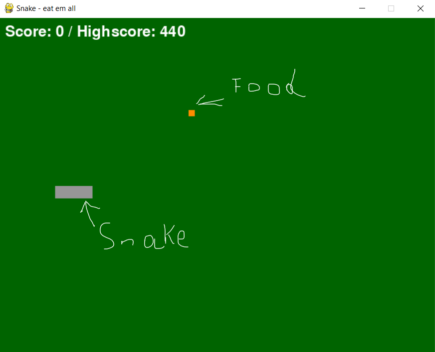
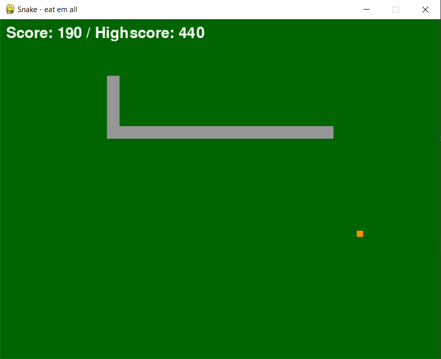
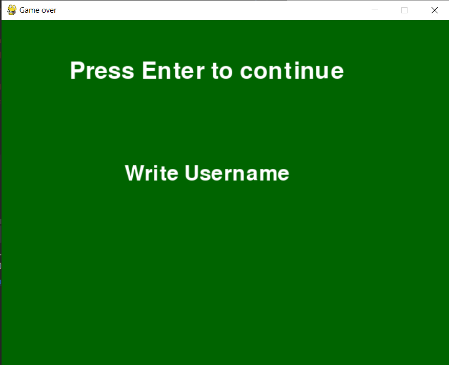
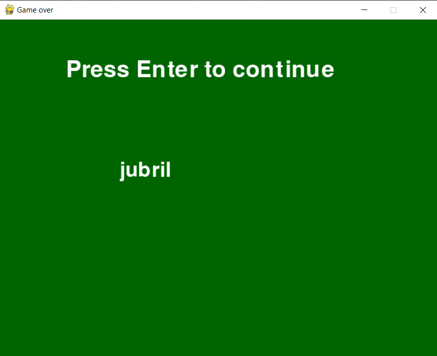
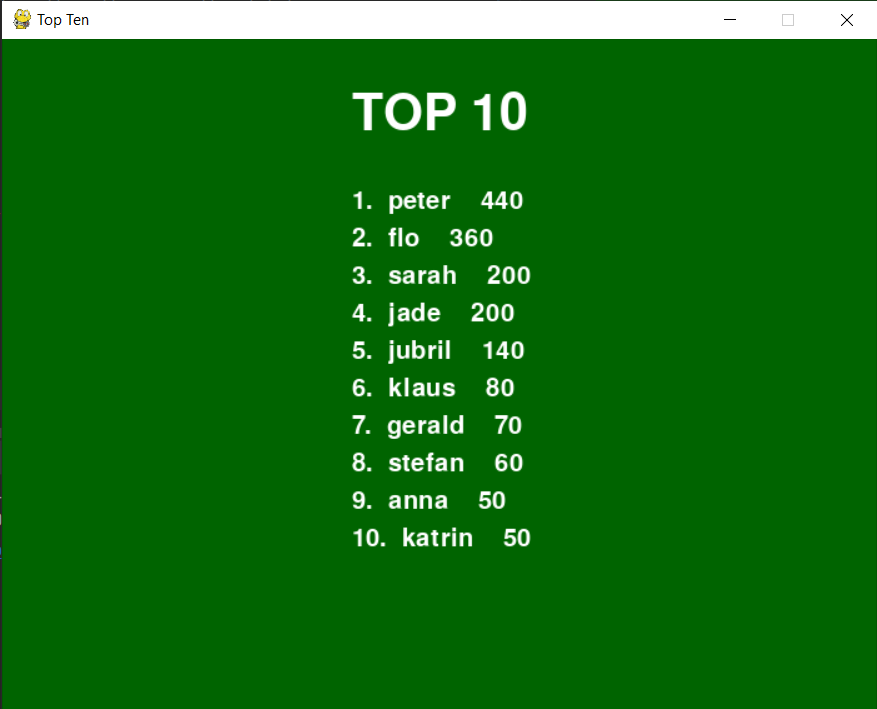

# Snake game
This repository contains the snake game. It's written in Python with pygame. 
Scores are saved into sqlite3. 

## Table of contents
* [Game description](#Game description)
* [Screenshots](#Screenshots)
* [Tech Stack](#Tech Stack)
* [Setup](#Setup)
* [License](#License)

## Game description

The main package of the game is **snakegame**. In this package are all modules that are needed for the game.

* The game.py file is where all components of the game are combined. 
    - It contains the main while loop that brings the game alive. 
    - In it, you can change e.g., screen size, speed of the game or the color of the board.
 
* food.py creates the object that must be collected to gain more points
* serpent.py creates the snake that is controlled by the player, using the arrow keys on the computer. 
    - A player must not go out of the screen or crash into to body of the snake, otherwise the game is over. 

* after_game.py displays the screen after the game is over, means if the user hit the wall or the snake bit itself.
    - _Write username_ can you should be deleted. Afterwards users can choose an individual username which is then store
      into the database. 
    - If the username already exist in the database then the points of the respective user will be updated
      in case the new points made are higher than those in the database.
    - Each player’s name is saved once

## Screenshots
### How the game starts
 

### After feeding the snake a couple of time

### Delete _Write Username_ with the **backspace** button.

### Enter username

### Afterwards press the **enter** button to display the top 10 highest scores
according to your current database on your device. This screen shows up 20sec then the
game quits.

## Tech Stack
- pygame 2.1.0
- python 3.9 or higher
- sqlite

## Setup
* Windows
    - Go the directory of the game. Type `py main.py` to your command line
* Mac
  - Type in python3 main.py

* Alternative you can execute the game by exeuting main.py in your preferred IDLE

## License
Coming soon

